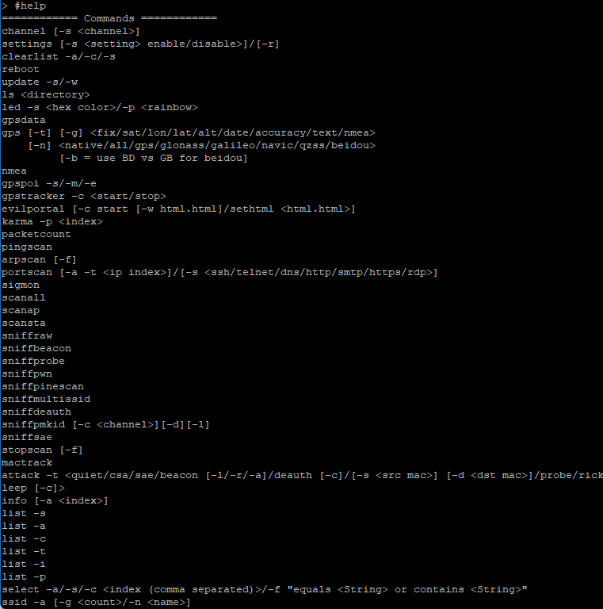
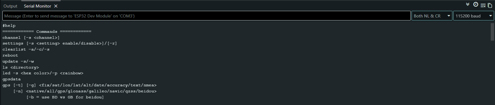

# ESP32 Marauder CLI (ESP32 Dev Module)

[](https://github.com/justcallmekoko/ESP32Marauder)
[]()
[]()

Minimal CLI version of ESP32 Marauder designed to run on a standard ESP32 Dev Module.

No display, no SD card, and no PSRAM required.

Author: ThuRein-110


---

## Features

- WiFi Access Point scanning
- WiFi Client scanning
- Probe request sniffing
- Beacon spam testing
- Serial CLI control

---

## Hardware

| Component | Value |
|----------|------|
| Board | ESP32 Dev Module |
| MCU | ESP32 |
| Flash | 4MB |
| PSRAM | None |

Connection:

`Computer → USB → ESP32`

---

## Software Environment

| Tool | Version |
|-----|--------|
| Arduino IDE | 2.x |
| ESP32 Board Package | 2.0.x |
| OS | Windows 10 |

Arduino Settings

| Setting | Value |
|--------|------|
| Board | ESP32 Dev Module |
| Upload Speed | 921600 |
| Flash Frequency | 80 MHz |
| Partition Scheme | Huge APP |
| Serial Baud | 115200 |

---

## Required Libraries

Install these from Arduino Library Manager:

- ESPAsyncWebServer
- AsyncTCP
- DNSServer
- WiFi

---

## Firmware Fixes

### Fix 1 — index_html Multiple Definition

Problem

`multiple definition of index_html`

Solution

**EvilPortal.h**

```cpp
extern char *index_html;
```

**EvilPortal.cpp**

```cpp
char *index_html = NULL;
```

Purpose

Prevents duplicate symbol errors during linking.

---

### Fix 2 — PSRAM Allocation

Original firmware used:

```cpp
ps_malloc()
```

Standard ESP32 Dev Module does not have PSRAM.

Solution

```cpp
index_html = (char*) malloc(MAX_HTML_SIZE);
strlcpy(index_html, htmlStr, MAX_HTML_SIZE);
```

Purpose

Allows HTML portal memory allocation using normal heap memory.

---

### Fix 3 — WiFi Driver Conflict

Compilation error

```
multiple definition of ieee80211_raw_frame_sanity_check
```

Cause

ESP32 WiFi driver already contains this function.

Solution

Remove the duplicate implementation from:

`WiFiScan.cpp`

---

### Fix 4 — Function Reference Error

Original code

```cpp
if (ieee80211_raw_frame_sanity_check(...))
```

Modified code

```cpp
if (true)
```

Purpose

Bypasses the firmware compatibility check.

---

## Flashing Firmware

1. Open the project in Arduino IDE  
2. Select board **ESP32 Dev Module**  
3. Connect ESP32 via USB  
4. Select the correct COM port  
5. Click **Upload**

After flashing open **Serial Monitor**

Set baud rate:

`115200`

---

## CLI Usage

Startup output:

`ESP32 Marauder CLI`

`Type help for commands`

`>`

---

## Commands

Show commands

`help`

Scan WiFi networks

`scanap`

Scan WiFi clients

`scansta`

Sniff probe requests

`sniffprobe`

Beacon spam test

`beacon`

Stop current operation

`stop`

---

## Example Output

```
SSID: HomeNetwork
Channel: 6
RSSI: -45
```

---

## Screenshots

CLI Interface



Serial Monitor


---

## Limitations

Unsupported features on ESP32 Dev Module:

- TFT Display
- SD Card logging
- PSRAM dependent modules

However CLI WiFi functionality works correctly.

---

## Educational Purpose

This project demonstrates:

- ESP32 firmware debugging
- Embedded firmware modification
- WiFi research experimentation
- Fixing linker and compilation errors

---

## Disclaimer

For **educational and security research purposes only**.

Only test networks you **own or have permission to test**.

Unauthorized wireless testing may be illegal.

---

## Author

GitHub: https://github.com/ThuRein-110